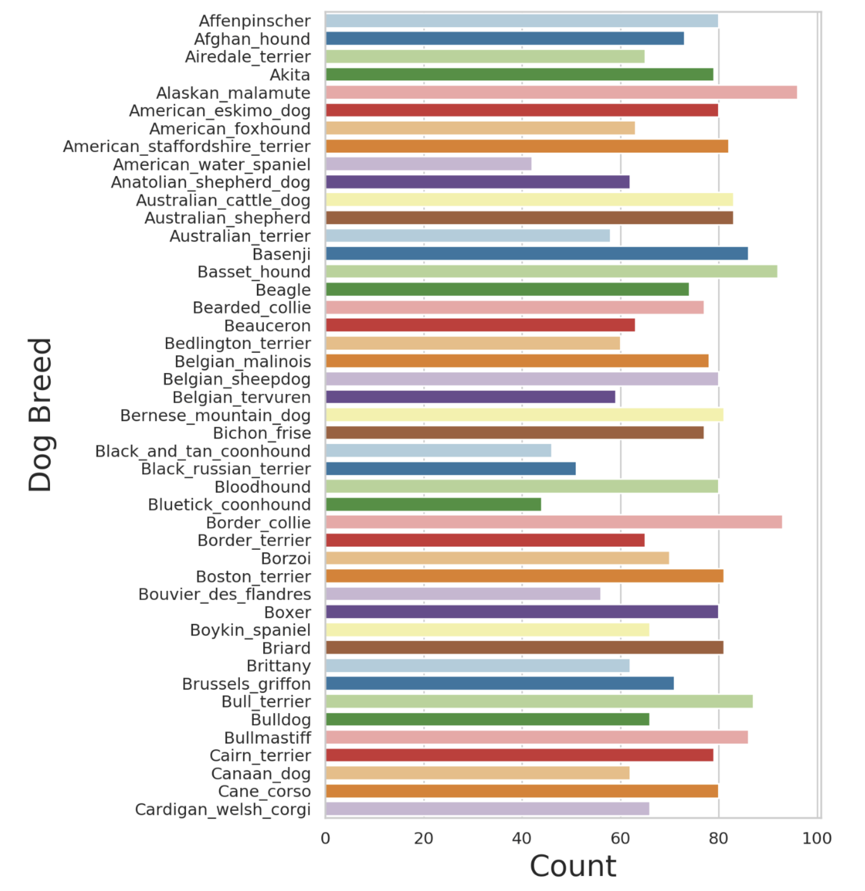
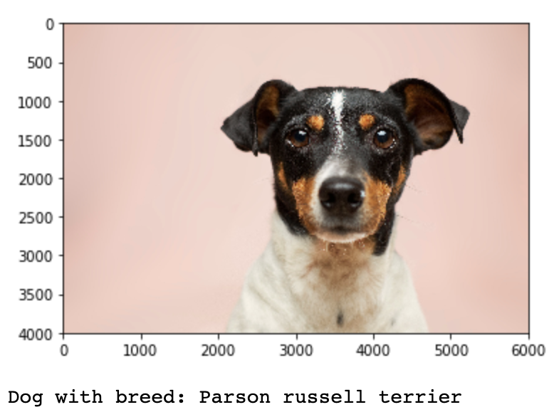
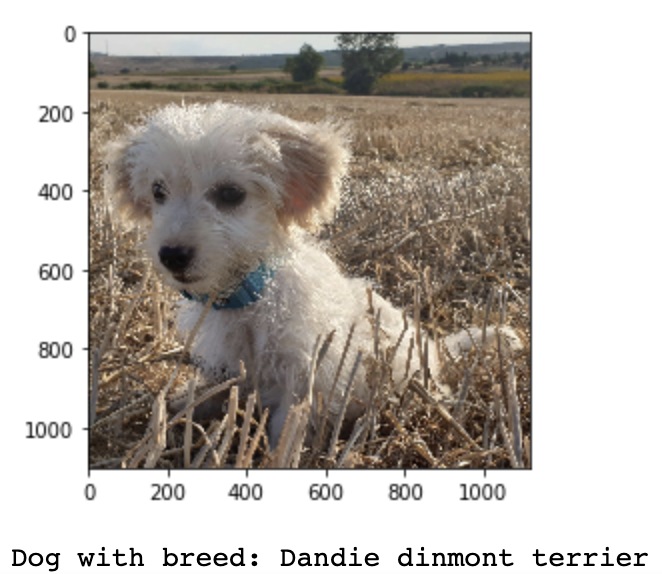
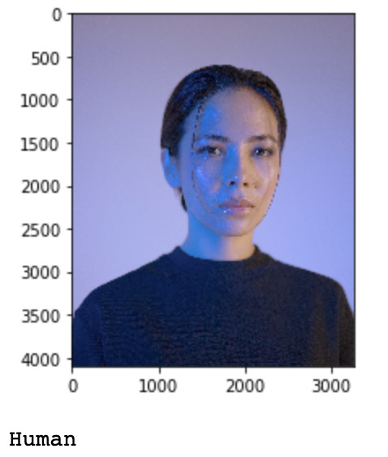

# Machine Learning Engineer Nanodegree

## Capstone Project

Arda Atahan İbiş
August 3rd, 2020

## I. Definition

### Project Overview

Throughout centuries, dogs have been an integral part of the human life. Due to their high running speed, acute sense of smell and hearing, hunting skills, and friendliness dogs have been cared as house pets, trained for service in order to assist such as the police, fire department, and etc. As the need for dogs in the human life increased, different dog breeds have been interbred in order to have a "new breed" that has the pros of the two parent breeds. Therefore, there are a wide variety of dog breeds, 339 according to the World Canine Organization (FCI)[1], each of which attains a relatively different role in the human life. Given the wide variety of dog breeds, it is virtually impossible for any human to predict the breed of a dog with high accuracy and the purpose of this project is to ultimately help the user to determine his/her dog's breed.

As aforementioned, there are a wide variety of dog breeds in the world and it is impossible for a human to accurately predict each breed from a given dog image. This problem can be thought of as a multi-class classification problem. Therefore, Each dog breed has its own label and every dog belongs to a single breed. The goal of this project is to accurately label, ideally more accurate than humans, a dog's breed from a given dog photo.

Since the problem is a multi-class classification problem, we can leverage machine learning methods in order to tackle this problem. Specifically, the methodologies that are made available by deep learning, convolutional neural networks in particular, mashes perfectly with the problem at hand.

Convolutional neural network (ConvNet) architectures make the explicit assumption that the inputs are images, which allows us to encode certain properties into the architecture. These then make the forward function more efficient to implement and vastly reduce the amount of parameters in the network.[2]

Therefore, I found convolutional neural networks to be the most promising solution to tackle this problem of dog breed classification as they work more efficiently in terms of finding patterns in images and classify them according to different classes.

In this project, two datasets have been provided by Udacity. The first dataset, the dog dataset (can be downloaded [here](https://s3-us-west-1.amazonaws.com/udacity-aind/dog-project/dogImages.zip)), containes a total of 8351 images of 133 different breeds of dogs. The second dataset, which will enable us to differentiate dog images from human images and ultimately prevent human images to be classified as dog breeds, is the human (can be downloaded [here](https://s3-us-west-1.amazonaws.com/udacity-aind/dog-project/lfw.zip)) dataset that contains 13233 images.

Given the relative scarcity of input dog images, using pretrained models seemed to be the most logical way to classify dog breeds. Furthermore, I have seen that transfer learning is way more effective than using a custom, non-trained model.

### Problem Statement

In this project, the main problem is to create a machine learning pipeline that is able to classify the uploaded user image into the 133 different dog breeds that the model has learned to detect. In particular, the application has to first detect whether the input image contains a human or a dog (or neither), and only if the input image contains a dog should it display the predicted breed of the dog. Apart from that the proposed model needs to have an accuracy of at least 60%.

### Metrics

The sole evaluation metric I will make use of in this problem is accuracy. In particular, I will take into account the testing accuracy (and will call it just accuracy throughout this report). Accuracy can be defined as follows[2]:

Accuracy is the number of correctly predicted data points out of all the data points. More formally, it is defined as the number of true positives and true negatives divided by the number of true positives, true negatives, false positives, and false negatives.

Visualizing:

Or alternatively:

The reason I chose accuracy in this classification problem is that in this problem I am trying to correctly predict the classes of the input image and therefore the ratio of true positives and false negatives in predicted labels are more important than other metrics.

## II. Analysis

### Data Exploration

As aforementioned, there are two main datasets that are going to be used in this project. Both of these datasets have been provided by Udacity.

Firstly, the dog dataset (can be downloaded [here](https://s3-us-west-1.amazonaws.com/udacity-aind/dog-project/dogImages.zip)) consists of 8351 dog images in jpg format partitioned into 133 different breeds (such as Affenpinscher, Black and Tan Coonhound, and etc.). This is the dataset that is going to be used in order to train, validate, and test the model that is going to be used in order to classify given dog images the model has not seen before as it contains a variety of images of certain breeds that we want to classify. The dataset is divided into training, validation, and test sets. The training set has a total of 6680 different images. The test and validation sets have 836 and 835 images respectively. Each image is of varying size, i.e. there is not any standard size across the dataset. In addition, all images are RGB images so that the input data has 3 different channels one for each color. One limitation to this dataset might be it falls short in providing enough data in order for the model to be able to classify all 339 different breeds in the world. Some sample images from the dataset:

American Water Spaniel

Curly Coated Retriever

Another dataset that is provided is the human dataset (can be downloaded [here](https://s3-us-west-1.amazonaws.com/udacity-aind/dog-project/lfw.zip)). The human dataset is not relevant for our classification problem. Its role in the overall application is to detect any human faces that is potentially uploaded by the user and prevent the human image to be classified as a dog breed. The human dataset consists of 13233 total human images in jpg format with a standard size of (250, 250). Like dog images, human images are also RGB. Some sample images from the dataset:

### Exploratory Visualization

In the bar chart below the number of dog images and their corresponding breeds can be found for the first 45 breed out of the 133 breeds[3]:

In the above chart, it can be seen that the count of input image across different classes are relatively balanced. Therefore, it can be claimed that we have enough balanced data that is adequate to avoid class imbalance problem. In addition, having such a balanced data will aid the model to distinguish well between different dog breeds as it will have enough "exposure" to each class.

### Algorithms and Techniques

1. Human face detector: Here a function that utilizes OpenCV's implementation of Haar feature-based cascade classifiers will be used in order to determine whether an image contains a human face or not.

2. Dog detector: Here a function that utilizes a pretrained VGG16 model is going to output the class index of the image. The model was trained with the ImageNet dataset with over 14 million images[5]. The model outputs 1000 classes however only class indices that are between 151 and 268 (inclusive) signal that a dog is detected in the image, which is enough for the sake of detecting dogs. I will not further train this model, I will only use it in order to detect whether an image contains a dog or not.

3. Dog breed classifier (scratch): In this step I will write my own dog breed classifier model using PyTorch and ConvNets. I will experiment with different architectures and find the one that is the most performant. I will use Udacity's dog dataset in order to train, validate, and test my model.

4. Dog breed classifier (pretrained): In this part, I am going to be using a pretrained model in order to surpass the accuracy of the benchmark model and the benchmark value. I decided to use a resnet50 architecture for this task, as it is a performant ConvNet and won the 1st place award on the ILSVRC 2015 classification task[6]. However, I will slighly alter the model architecture for the fully connected layer to output 133 classes. I will also freeze all of the convolutional layers and just train the fully connected layer using Udacity's dog dataset. Then I will validate and test the model using the same dataset.

5. Writing the algorithm: In this step I will utilize what I achieved in the previous steps to write the application algorithm. I will first plot the image that the user uploaded to the application. Then, the image will be inputed to the human face detector. If a human face is detected the application will print "Human". Else if the image does not contain a human face, the image will be inputted to the dog detector. If a dog face is detected then the pretrained model will take the image as input, classify the breed of the dog and print it. Else if a dog face is not detected the application will print "Neither dog nor human".

### Benchmark

With my solution model I will compare my results to a benchmark model and a benchmark result. Ideally, I expect my model to surpass both of these benchmarks in terms of the evaluation metric, that is accuracy.

The benchmark model is going to be the convnet I built and trained with the given input dog training data. Then, I validated and tested this model with the validation and test sets. The network architecture I used for this model is as follows (with relu activation at the end of each convolutional layer and a dropout of probability 0.1 before the fully connected layer):

    - (conv1): Conv2d(3, 16, kernel_size=(3, 3), stride=(1, 1), padding=(1, 1))
    - (max_pool): MaxPool2d(kernel_size=2, stride=2, padding=0, dilation=1, ceil_mode=False)
    - (conv_bn1): BatchNorm2d(16, eps=1e-05, momentum=0.1, affine=True, track_running_stats=True)
    - (conv2): Conv2d(16, 32, kernel_size=(3, 3), stride=(1, 1), padding=(1, 1))
    - (max_pool): MaxPool2d(kernel_size=2, stride=2, padding=0, dilation=1, ceil_mode=False)
    - (conv_bn2): BatchNorm2d(32, eps=1e-05, momentum=0.1, affine=True, track_running_stats=True)
    - (conv3): Conv2d(32, 64, kernel_size=(3, 3), stride=(1, 1), padding=(1, 1))
    - (max_pool): MaxPool2d(kernel_size=2, stride=2, padding=0, dilation=1, ceil_mode=False)
    - (conv_bn3): BatchNorm2d(64, eps=1e-05, momentum=0.1, affine=True, track_running_stats=True)
    - (conv4): Conv2d(64, 128, kernel_size=(3, 3), stride=(1, 1), padding=(1, 1))
    - (max_pool): MaxPool2d(kernel_size=2, stride=2, padding=0, dilation=1, ceil_mode=False)
    - (conv_bn4): BatchNorm2d(128, eps=1e-05, momentum=0.1, affine=True, track_running_stats=True)
    - (conv5): Conv2d(128, 256, kernel_size=(3, 3), stride=(1, 1), padding=(1, 1))
    - (max_pool): MaxPool2d(kernel_size=2, stride=2, padding=0, dilation=1, ceil_mode=False)
    - (conv_bn5): BatchNorm2d(256, eps=1e-05, momentum=0.1, affine=True, track_running_stats=True)
    - (max_pool): MaxPool2d(kernel_size=2, stride=2, padding=0, dilation=1, ceil_mode=False)
    - (fc6): Linear(in_features=12544, out_features=133, bias=True)

The accuracy of this model on the test set was found to be 29%. So, ideally, I need to be scoring more than 29% with a pretrained model.

Another benchmark result is the one that was provided by Udacity which is 60%. So, my model should also be classifying input dog images with an accuracy of higher than 60%.

## III. Methodology

### Data Preprocessing

Since the dog dataset contains RGB images in jpg format of varying sizes, they need to be preprocessed before they can be inputted to the models that are used in this application.

First of all, the input dog dataset is going to be accessed by PyTorch and will be preprocessed accordingly to which set (training, validation, and testing) they belong to. For the training set, I decided to use several data augmentation methods in order to increase the diversity of data and prevent overfitting. The data preprocessing steps for the training set I used are as follows[7]:

    1. The input image is rotated randomly. The rotation angle (in degrees) varies in the range (-30, 30).
    2. The input image is resized to a random size and aspect ratio of size (in pixels) (224, 224).
    3. The input image is then randomly flipped horizontally with a default probability of 0.5.
    4. The input image's brightness, contrast, saturation, and hue are randomly altered.
    5. The input image is then turned into a tensor.
    6. The input image is then normalized with mean and std assigned to the standard ImageNet mean and std.

For the validation and test set I decided to just use the 5th and 6th steps of the previous data preprocessing pipeline. They are first tensorized and then normalized accordingly. The reason for not applying image augmentation for them is data augmentation only helps during training time for the model to generalize well and I do not necessarily need more data in validation and test sets.

Then these datasets are going to be uploaded to dataloaders which are going to shuffle the input images and separate them into batches of 64. The training, validation, and testing of the input data is going to be done using these dataloaders.

### Implementation

1. Human face detector: Here a function that utilizes OpenCV's implementation of Haar feature-based cascade classifiers will be used in order to determine whether an image contains a human face or not. If a human face is detected the function will return True, else it will return False. When tested, the human face detector predicted a human face 98% accuracy in a dataset full of human faces. However, it falsely classified 17% of images as human in a dataset full of dog images.

2. Dog detector: Before the model I built classifies the dog image into a particular breed the application needs to determine whether a dog is present in the image or not. This step is going to be done using a function that is going to utilize a pretrained VGG16 model that is made available by PyTorch[8]. I will use transfer learning in this step in order to be able to effectively detect a dog image. This will also save a lot of time and effort as it is impossible for me to implement a comparable model with the given size of input dataset. In addition, the pretrained model has been trained on the ImageNet dataset, which proves it more effective than any model I could potentially build. I am not going to further modify the model or use the training dataset to further train it. The model outputs 1000 different classes, however only class indices that are between 151 and 268 (inclusive) signal that a dog is detected in the image. The function will check if the returned class is between or equal to these values.

3. Dog breed classifier (scratch): In this step I am going to build a ConvNet from scratch that is going to classify the dog breeds from input image. As I am going to be building this model from scratch, I will use the training dataset to train each layer of the model. I will use this model as a benchmark for the next model I am going to build using one of the pretrained models PyTorch has to offer. Ideally, I am expecting a pretrained model to surpass my custom model as the former is trained on a larger dataset and has an architecture that is proven through research to perform well. I am going to use Adam optimizer with a learning rate of 0.001 and Cross Entropy Loss Function to tune my model as this is a classification task. I set the epoch count to 20. I will train, validate, and test my model on a GPU using the dataloaders that were discussed in the Data Preprocessing section. The schema of the model can be seen in the Benchmark section. The evaluation metric is going to be accuracy for this model.

4. Dog breed classifier (pretrained): In this step I am going to use a pretrained model that was trained on the ImageNet dataset and was proven through research to be performant on image classification tasks, much like step 2. However, this time I am going to use the resnet50 architecture. I am going to freeze each convolutional layer as I do not need further training in these layers and also I do not have necessary data to have a remarkable increase in performance upon training convolutional layers. However, I am going to change the fully connected layer of the ConvNet in order to be able to output 133 different class likelihood values, which is necessary to solve my classification problem. The training data is going to be used in order to train the final fully connected layer. In addition, I will validate the model using the validation set while training and test it after the training has finished. The evaliation metric is again accuracy for this model. I am expecting to surpass 60% accuracy (and 29% accuracy of the classifier that was built from scratch). I set the epoch count to 20. I am going to use Adam optimizer with a learning rate of 0.001 and Cross Entropy Loss Function to tune my model as this is a classification task. The schema for the used model can be seen below[9]:

5. Writing the algorithm: In this step I will write a function that is first going to load the new image and show it to the user. Then, the function is going to determine whether the given input image contains a human or not using the prewritten function that utilizes OpenCV's implementation of Haar feature-based cascade classifiers. If the face belongs to a human, the function will only output the word "Human". Else if the face does not belong to a human, the function then will check if the image belongs to a dog, also utilizing the prewritten function that uses a pretrained VGG16 model to detect dog faces. If the image belongs to a dog, my custom transfer learning model will then take the image as input and output the likelihood of each class. Then the class with the highest likelihood is going to be chosen and the corresponding class label is going to be printed to the user. Else if the image containes neither a human nor a dog, the function is going to print "Neither dog nor human".

### Refinement

The initial model I used for the dog breed classifier I built from scratch did not utilize batch normalization and had an epoch count of 10. The accuracy of that model turned out to be 7%. Then I decided to introduce batch normalization and a higher epoch count of 20. The latter model had an accuracy of 29%.

I did not need to improve the pretrained model as it had an accuracy of 85%, well above the benchmark.

## IV. Results

### Model Evaluation and Validation

The final model I have has an accuracy of 85%. As aforementioned I have chosen a resnet50 architecture that was pretrained on the ImageNet dataset. I altered the fully connected layer and trained it to output 133 classes of dog breeds. I figured that the Adam optimizer with a learning rate of 0.001 and an epoch count of 20 performed great in this case. I, overall, believe that the final model is highly appropriate for this problem given the scarcity of training data.

I have used various different images that were not on the dog dataset, including one that I took. The results were highly accurate, the model can adequately differentiate between different dog breeds. However, it sometimes mixes up similar breeds and does not perform accurately in such cases. For example, I uploaded an image of a Maltese Terrier; however, the application printed Dandie Dinmont Terrier. Although these two breeds do look very similar, I would expect the model to differentiate between similar models. Apart from that, the model can indeed generalize well to unseen data as it did not have any trouble predicting the breeds of dogs that I uploaded. Therefore, I can claim that the model is highly stable and variations in the input space does not affect the results.

### Justification

The final solution model I came up with had a testing accuracy of 85%. The first benchmark I chose was the model I built from scratch. Although that model was only trained for a total of 20 epochs and had an input dataset size of 6680 images, it achieved 29% accuracy. So, in ideal terms, the transfer learning model needs to be way higher than that with 20 epochs. I also took into account a benchmark value of 60%, though I was expecting to achieve a lot higher than that. In the end the model achieved a testing accuracy of 85%, which is significantly higher than both benchmarks. The model is able to classify dog breeds pretty accurately, sometimes mixing up dog breeds that look similar. However, it works accurate enough for a convenient user experience.

## V. Conclusion

### Free-Form Visualization

Above, two sample outputs can be seen from the model. The first output is accurate as the model truly detects a Parson Russel Terrier. However, the second classification is not true as the dog is a Maltese Terrier. Here is an image of a Dandie Dinmont Terrier for a comparison of their visuals[10]:

Below is a human image that was correctly labeled as a human and thus was not inputted to the dog breed classifier:

### Reflection

The end-to-end problem solution can be summarized as follows:

    1. The appropriate data was acquired and key statistics were observed.
    2. A face detector function was written.
    3. A dog detector function utilizing a pretrained VGG16 model was written.
    4. Image sets were transformed accordingly and the training set was augmented.
    5. Each set was uploaded to their respective dataloader, shuffled, and separated into batches of 64.
    6. A dog breed classifier was created from scratch, trained, validated, and tested.
    7. A pretrained dog breed classifier was altered to output 133 classes, its fully connected layer was trained, the whole model was validated, and tested.
    8. An algorithm was written in order to detect human or dog faces in images. If a dog face is detected the algorithm prints the breed of the dog.
    9. I tested the algorithm with different images I found on the Internet. I also supplied some images that I myself took.

I found step 6 to be the most challenging one because I experimented with different model architectures and the training phase lasted a bit long even though I used a GPU. The most interesting aspect of the project was witnessing the effectiveness of transfer learning especially during step 7.

### Improvement

- The dataset was relatively small with 133 different dog breeds (out of the 339 recognized breeds). In addition, the training dataset contained only 6680 images, which is insufficient for a system that aims to outperform human accuracy rates on dog breed classification. Having a larger dataset with the missing breeds and more images would further improve the accuracy of the model.
- Hyperparameter tuning for the convolutional layers would also improve especially with a larger dataset. I only trained the fully connected layer in the transfer learning model. However, if enough data was supplied I would be able to further train the convolutional layers and have a better performance in terms of accuracy.
- Increasing the epoch count would also further improve the performance. The model was only trained with 20 epochs. Increasing the epoch count without allowing the model to overfit would improve the performance drastically.

### References

1. [Dog breeds](https://www.psychologytoday.com/us/blog/canine-corner/201305/how-many-breeds-dogs-are-there-in-the-world)
2. [ConvNets](https://cs231n.github.io/convolutional-networks/)
3. [Data visualization chart](https://github.com/BayTown/UD-MLND-Dog-Breed-Classifier/blob/master/report.pdf)
4. [Haar feature-based cascade classifiers](http://docs.opencv.org/trunk/d7/d8b/tutorial_py_face_detection.html)
5. [ImageNet classes](https://gist.github.com/yrevar/942d3a0ac09ec9e5eb3a)
6. [resnet50](https://arxiv.org/abs/1512.03385)
7. [Torchvision Transforms](https://pytorch.org/docs/stable/torchvision/transforms.html)
8. [Pretrained VGG16](https://pytorch.org/docs/stable/torchvision/models.html)
9. [resnet50 schema](https://www.researchgate.net/publication/331364877/figure/fig3/AS:741856270901252@1553883726825/Left-ResNet50-architecture-Blocks-with-dotted-line-represents-modules-that-might-be.png)
10. [Dandie Dinmont Terrier](https://keyassets.timeincuk.net/inspirewp/live/wp-content/uploads/sites/8/2020/02/GettyImages-821285366-scaled.jpg)
